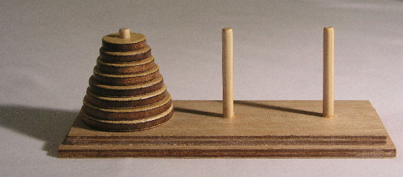

# Tower Of Hanoi
 
The Tower of Hanoi is a mathematical game or puzzle consisting of three rods and a number of disks of various diameters, which can slide onto any rod. The puzzle begins with the disks stacked on one rod in order of decreasing size, the smallest at the top, thus approximating a conical shape. The objective of the puzzle is to move the entire stack to the last rod, obeying the following rules:

1- Only one disk may be moved at a time. 
2- Each move consists of taking the upper disk from one of the stacks and placing it on top of another stack or on an empty rod.  
3- No disk may be placed on top of a disk that is smaller than it.

With 3 disks, the puzzle can be solved in 7 moves. The minimal number of moves required to solve a Tower of Hanoi puzzle is 2n − 1, where n is the number of disks. 

steps:  
1- fork this repository  
2- in your code create stack objects represents the three rods  
3- push 3 disk objects in the first rod  
4- use pop & push functions to move the disks from the first rod to 
th third rod  
5- repeat the steps for 5 disks & 7 disks 
